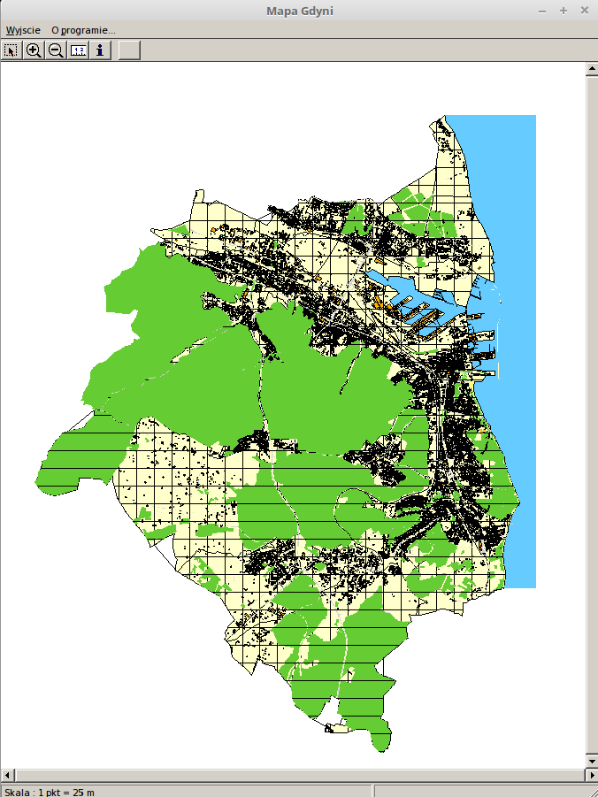
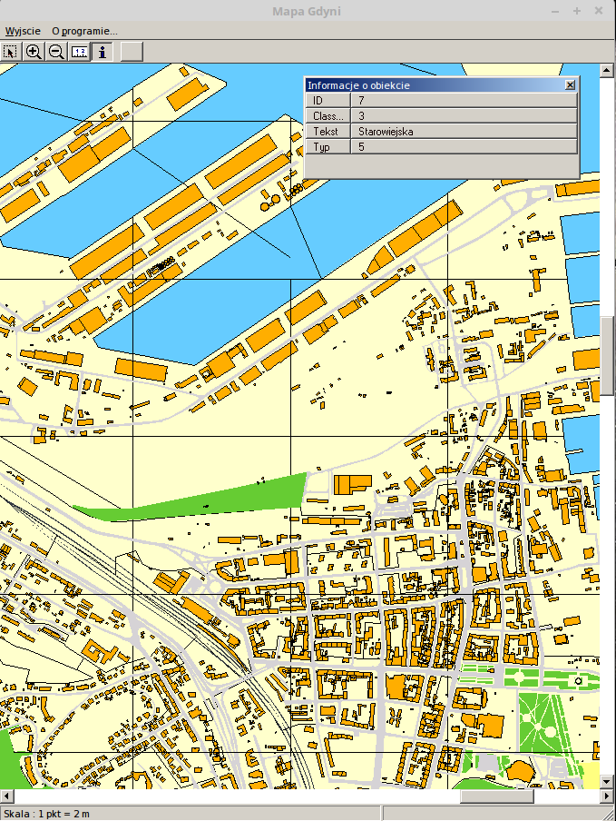

# paleo-map-of-gdynia
Digital map of Gdynia from 2001 city website data.  Win32 Borland C++ Builder based application.  

This is my own, 'paleo code' now, project from around 2001. I've reversed eng. ArcGIS Java applet code on city official map page, downloaded data,
and worte Borland C++ Builder Win32 app to display it offline.  

Program has basic funcionalities like zooming, panning, measure and object info.

I've attached binary release. It even runs on Linux, under Wine.
[Win32 binary release](https://github.com/jedrus2000/paleo-map-of-gdynia/releases/)

Screenshots:  

